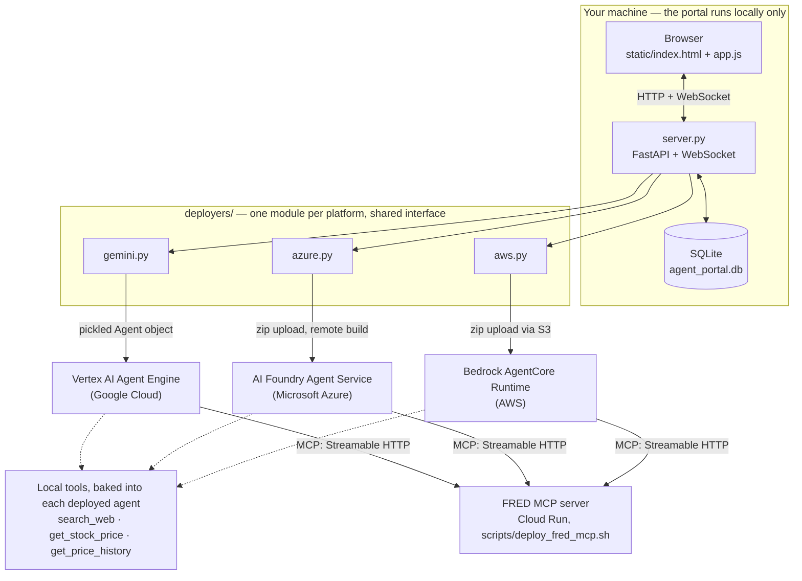

# Agent Portal

A local web UX for creating, chatting with, and managing hosted agents
across cloud platforms. Unlike the `~/Dev/Azure`/`~/Dev/AWS`/`~/Dev/Gemini`
comparison projects -- each one hand-written agent per cloud -- this portal
lets you dynamically configure many agents (name, model, description,
agent instructions, tools) through a form and have each one actually deployed
as a real hosted agent, not run locally.

## Documentation

This README covers what's true of the portal as a whole: scope, setup,
testing, architecture, MCP servers, and known gaps. The per-platform and
per-topic detail lives alongside it:

- **[docs/aws.md](docs/aws.md)** -- how AWS deploy works, the one-time
  AgentCore Gateway setup behind AWS's managed web search, and how AWS
  traces work.
- **[docs/azure.md](docs/azure.md)** -- how Azure deploy works and how Azure
  traces work.
- **[docs/gemini.md](docs/gemini.md)** -- Gemini's `min_instances=0` default,
  and how Gemini traces work.
- **[docs/latency.md](docs/latency.md)** -- diagnosing "why is this agent
  slow" from a single turn's latency card, and the interactive load test that
  turns those numbers into percentiles (one agent or two, head to head).
- **[docs/backlog.md](docs/backlog.md)** -- known gaps worth fixing, each with
  the failure that justifies it.

## Scope

- Platforms: **Gemini** (Vertex AI Agent Engine), **Azure** (AI Foundry
  Agent Service), and **AWS** (Bedrock AgentCore Runtime) are all
  implemented.
- Tools: **Web search** and **Stock data**, reusing `tools.py` (copied
  verbatim from `~/Dev/Gemini/tools.py`). AWS agents also get a second,
  more capable web search option -- AWS's own managed Web Search Tool via
  an AgentCore Gateway connector, one-time setup by
  `./scripts/setup_aws_web_search.py` -- see
  [AWS web search via AgentCore Gateway](docs/aws.md#aws-web-search-via-agentcore-gateway).
- Trace panel: **AWS**, **Gemini**, and **Azure** are all implemented --
  see [How AWS traces work](docs/aws.md#how-aws-traces-work) /
  [How Gemini traces work](docs/gemini.md#how-gemini-traces-work) /
  [How Azure traces work](docs/azure.md#how-azure-traces-work).
- MCP servers: an agent can mix any number of local tools with any number
  of remote MCP servers in the same tool-calling loop, verified directly
  in all three frameworks. **FRED** (economic data) is the first one
  available -- see [MCP servers](#mcp-servers).
- Latency diagnosis: every turn's trace panel breaks down *why* it was
  slow -- cold start, tool-call trajectory, token counts/growth, and
  (AWS only so far) retries -- see
  [Diagnosing "why is this agent slow"](docs/latency.md#diagnosing-why-is-this-agent-slow).
- Interactive load test: the **Load Test** button runs a small, real
  concurrency check against one or two active agents from the browser --
  either a full chat turn or, isolating what the platform itself costs
  before the agent's own code runs with no LLM call at all,
  platform-startup-only -- live progress, then summary
  stats and charts, with a dedicated head-to-head view (callout + bar
  charts) when comparing two agents -- see
  [Interactive load test](docs/latency.md#interactive-load-test).

## How agent deploy works

`vertexai.agent_engines.create()` takes a constructed ADK `Agent` object
directly -- no CLI subprocess, no Terraform, no generated source files,
unlike every deploy in `~/Dev/Gemini`. Confirmed via `smoke/smoke_test.py`: the
SDK pickles the agent object itself (`cloudpickle`) and uploads it to a
GCS staging bucket alongside a `requirements.txt` it auto-augments with
`cloudpickle`/`pydantic` pins, rather than building a container from
source the way `adk deploy agent_engine` and the Terraform path both do.
See `deployers/gemini.py`.

A GCS staging bucket is **required** by the SDK
(`vertexai.init(..., staging_bucket=...)`) -- not optional. Create one and
point `STAGING_BUCKET` at it in `.env`:

```
gcloud storage buckets create gs://<bucket-name> --location=<region>
```

AWS needs its own one-time setup (see [How AWS deploy
works](docs/aws.md#how-aws-deploy-works)): a shared IAM execution role and an
S3 staging bucket.

```
aws iam create-role --role-name agent-portal-agentcore-execution \
  --assume-role-policy-document '{"Version":"2012-10-17","Statement":[{"Effect":"Allow","Principal":{"Service":"bedrock-agentcore.amazonaws.com"},"Action":"sts:AssumeRole"}]}'
aws iam put-role-policy --role-name agent-portal-agentcore-execution \
  --policy-name agent-portal-agentcore-execution-policy \
  --policy-document '{"Version":"2012-10-17","Statement":[{"Effect":"Allow","Action":["bedrock:InvokeModel","bedrock:InvokeModelWithResponseStream"],"Resource":["arn:aws:bedrock:*:<account-id>:inference-profile/*","arn:aws:bedrock:*::foundation-model/*"]},{"Effect":"Allow","Action":["logs:CreateLogGroup","logs:CreateLogStream","logs:DescribeLogStreams","logs:FilterLogEvents","logs:GetLogEvents","logs:PutLogEvents"],"Resource":"arn:aws:logs:<region>:<account-id>:log-group:/aws/bedrock-agentcore/runtimes/*"},{"Effect":"Allow","Action":"logs:DescribeLogGroups","Resource":"*"},{"Effect":"Allow","Action":["xray:PutTraceSegments","xray:PutTelemetryRecords"],"Resource":"*"}]}'
aws s3api create-bucket --bucket <bucket-name> --region <region>
```

AWS agents can be deployed either way `CreateAgentRuntime` allows -- a code
zip (the default) or a container image built locally and pushed to ECR, picked
per agent in the New Agent form. Code zip needs nothing beyond the above.
Container mode needs Docker running plus its own one-time AWS setup, which is a
script (idempotent, reads `.env`, creates the ECR repository and grants the
execution role above permission to pull from it):

```
./scripts/setup_aws_container.sh
```

See [Container deploys](docs/aws.md#container-deploys) for what it does and why
the pull permission is scripted rather than left as a command to copy.

AWS's managed web search tool is also optional one-time setup, and also a
script -- it creates the AgentCore Gateway, attaches the Web Search Tool
connector, and grants the execution role above permission to invoke it:

```
./scripts/setup_aws_web_search.py
```

See [AWS web search via AgentCore
Gateway](docs/aws.md#aws-web-search-via-agentcore-gateway). Skip it and the
tool simply stays greyed out in the New Agent form; the keyless DuckDuckGo
**Web search** tool needs no setup at all.

Azure needs its own one-time setup too, for tracing specifically (see
[How Azure traces work](docs/azure.md#how-azure-traces-work) for the full
commands): an Application Insights resource, connected to the Foundry
project.

## Setup

```
cp .env.example .env   # fill in the values for whichever platform(s) you're using
gcloud auth application-default login
az login
aws login   # or your account's equivalent
./run.sh
```

Opens `http://127.0.0.1:8910`.

## Testing

Two different kinds of test, deliberately kept separate:

- **`pytest` (fast, free, runs in CI on every PR)** -- unit tests for pure
  logic (`deployers/__init__.py`'s thread bridge, name-slugifying,
  tool-selection) plus full API/WebSocket-protocol tests against the real
  FastAPI app with every deployer swapped for an in-memory fake (see
  `tests/conftest.py`'s `FakeDeployer`). Nothing in this suite makes a
  real cloud call or needs real credentials.

  ```
  pip install -r requirements-dev.txt
  pytest
  ```

  This suite also covers a slice of the *frontend*:
  `tests/test_static_charts.py` shells out to node to run
  `tests/js/chart_checks.mjs`, which asserts on the SVG that `static/app.js`'s
  load-test chart functions actually emit -- which marks appear, where they
  sit, and what the axes say. `static/app.js` is a no-build-step script that
  can't be imported under node, so those functions are extracted from it
  textually; that's the price of not adding a package.json, a JS runner, and
  a second CI job for one file. The alternative was eyeballing a chart in a
  browser after a multi-minute live load test, which had already let three
  chart bugs through. Skips cleanly where node isn't installed; CI's runners
  have it, so it does run there.

- **`smoke/smoke_test.py` / `smoke/azure_smoke_test.py` / `smoke/aws_smoke_test.py` (slow,
  real, manual)** -- actually deploy a throwaway agent, chat with it, and
  delete it, against the real Gemini/Azure/AWS APIs. These cost real time
  (tens of seconds to minutes) and money (pennies) per run and need real
  credentials, so they intentionally do **not** run in CI -- run them by
  hand before trusting a change to a deployer's real cloud-facing code
  path (`deploy`/`undeploy`/`create_session`/`stream_chat`), the same way
  they were used to verify all three deployers while building them.

GitHub Actions (`.github/workflows/tests.yml`) runs the `pytest` suite on
every push/PR against `main`; branch protection requires it to pass
before merging.

To verify a deployer's core mechanism standalone before trusting the
portal: `./smoke/smoke_test.sh` (Gemini), `./smoke/azure_smoke_test.sh` (Azure),
`./smoke/aws_smoke_test.sh` (AWS). Each deploys a throwaway agent, confirms it's
listable, asks it a real question, then deletes it.

## Seeding existing agents

On startup, the portal calls each deployer's `list_deployed()` against
the configured account/project and imports any deployed agent it doesn't
already know about -- including the agents already deployed from
`~/Dev/Gemini`, `~/Dev/Azure`, and `~/Dev/AWS`. Their original
model/agent-instructions/tools are backfilled from known values (`server.py`'s
`KNOWN_LEGACY_AGENTS`); any other pre-existing agent found this way is
imported with a generic "(imported -- original config unknown)"
description, since a deployed resource's own metadata doesn't expose the
agent instructions or tool list it was built with.

Set `AGENT_PORTAL_NO_SEED=true` to turn this off, so the portal only lists
agents it created itself. Worth doing on an account that hosts a lot of
unrelated agents: an imported row often can't be chatted with (its payload
contract isn't this portal's), and its Delete button issues a real delete
against another project's resource. Clearing those rows out of the database
alone doesn't stick -- the next startup re-imports them.

## Architecture



- `server.py` -- FastAPI app: agent CRUD (`/api/agents`), a per-agent chat
  WebSocket (`/ws/agents/{id}`), serves `static/`. Deploys/undeploys run
  as background tasks since they're real cloud calls (create takes on the
  order of a minute; see `smoke/smoke_test.py` output for a measured baseline)
  -- the frontend polls `GET /api/agents` while any agent is
  `creating`/`deleting`.
- `db.py` -- SQLite (`agent_portal.db`), one `agents` table.
- `deployers/` -- one module per platform behind a shared interface (see
  `deployers/__init__.py`'s docstring): `deploy`/`undeploy`/`list_deployed`
  are sync (real, slow cloud calls run via BackgroundTasks/threads);
  `create_session`/`close_session`/`stream_chat` are async, since chat is
  long-lived per WebSocket and Azure specifically needs to hold open async
  SDK clients across turns. All three (`gemini.py`, `azure.py`, `aws.py`)
  are implemented.
- `static/` -- vanilla JS + CSS, no build step. `app.js` renders the
  agent-card list, the new-agent modal, and the chat view; the chat
  WebSocket protocol (`answer_start`/`answer_delta`/`answer_end`) matches
  every other `demo_web.html` in this overall project.
- `tools.py` -- the agent-facing tool implementations (`search_web`,
  `get_stock_price`, `get_price_history`). Deliberately at the repo root
  rather than in a subfolder: it's imported as a flat top-level `tools`
  module both locally (`deployers/gemini.py`) and *inside* every deployed
  container (`aws_hosted/main.py`, `azure_hosted/main.py`), which is how it
  gets copied into each deployment zip.
- `perf/` -- latency measurement: `loadtest.py` (the concurrent-session
  engine behind both the CLI and the portal's own Load Test view, so
  `server.py` imports it) and `latency_monitor.py` (tails
  `logs/latency.jsonl`). Kept together because their percentile math is
  deliberately identical -- see `perf/__init__.py`.
- `smoke/` -- the manual, real-cloud smoke tests and their wrappers. A
  sibling of `tests/` rather than a subdirectory of it on purpose: all
  three match pytest's default `*_test.py` collection pattern, so under
  `tests/` CI would collect them and start making real cloud calls on
  every run.
- `scripts/` -- one-time infrastructure setup, separate from running the
  portal (`deploy_fred_mcp.sh`, `setup_aws_container.sh`,
  `setup_aws_web_search.py`).
- `docs/` -- the per-platform and per-topic write-ups this README links to
  (see [Documentation](#documentation) above). Only the material that's true
  of the portal as a whole stays here; anything that's specifically about one
  cloud, or about latency measurement, lives in `docs/`.

## Backlog

- **Edit agent** (name, description, agent instructions, model, tools). Not
  clumsy to add later: any of these fields requires rebuilding the whole
  `Agent` object and re-pickling it regardless of which field changed, so
  there's no cheap subset -- all fields go through the same path.
  `vertexai.agent_engines.update(resource_name, agent_engine=..., 
  display_name=...)` (same shape as `create()`, confirmed via
  `inspect.signature()`) looks like the right call: it should let an edit
  rebuild in place, keeping the same resource id and existing sessions,
  rather than delete+recreate. Likely a similar ~1-4 min cost to a create,
  since it rebuilds the container either way.
- **A real MCP server registry** (add/configure/delete/test servers from
  the UI, backed by the database like agents already are) instead of
  `AVAILABLE_MCP_SERVERS` being a static dict in `deployers/__init__.py`.
  Fine for a couple of manually-deployed servers; worth revisiting once
  there are more (SEC filings, etc.) -- effectively a small "AI gateway."

## MCP servers

An agent can mix any number of local tools with any number of remote MCP
servers in the same tool-calling loop -- verified directly against all
three frameworks (not just read about) before building anything:

```python
# ADK
Agent(tools=[local_fn, McpToolset(connection_params=StreamableHTTPConnectionParams(url=...))])
# Agent Framework
async with mcp_tool: Agent(tools=[local_fn, mcp_tool])
# Strands
Agent(tools=[tool(local_fn), *MCPClient.load_servers({"mcpServers": {...}})])
```

`deployers/__init__.py`'s `AVAILABLE_MCP_SERVERS` is the registry the
create-agent form's checkboxes and each deployer's `deploy()` both read
from -- a static dict for now (see Backlog), keyed by id, each entry
holding a label/url/description. Selected ids flow through exactly like
`tool_ids` already do: `CreateAgentRequest.mcp_servers` -> `db.py`'s
`mcp_servers` column -> each deployer resolves ids to URLs and passes them
to the deployed agent the same way it passes that agent's tools -- an
`AGENT_MCP_SERVERS`/`AGENT_TOOLS` env var pair on Azure, a field in the
`agent_config.json` shipped inside the artifact on AWS (see [docs/aws.md's
"Why AWS agent config ships in the
artifact"](docs/aws.md#why-aws-agent-config-ships-in-the-artifact)).

### FRED (economic data)

The first available server. There's no publicly hosted FRED MCP server to
just point at -- `scripts/deploy_fred_mcp.sh` deploys
[stefanoamorelli/fred-mcp-server](https://github.com/stefanoamorelli/fred-mcp-server)
(pinned to a specific commit, not HEAD) to Cloud Run:

```
./scripts/deploy_fred_mcp.sh
```

One-time prerequisite: a free FRED API key from
https://fred.stlouisfed.org/docs/api/api_key.html (just an email signup,
under a minute). The script prompts for it on first run and stores it in
Secret Manager -- never written to a file, never in shell history. It
also enables the required APIs and grants Cloud Run's service account
access to the secret. Set `FRED_MCP_SERVER_URL` in `.env` to the printed
`.../mcp` URL afterward.

The deployed server itself has no auth of its own -- it's reachable by
anyone with the URL, deliberately: requiring GCP IAM auth would block
Azure/AWS-hosted agents from ever being able to call it, and FRED data
itself is public/non-sensitive. The real FRED API key never leaves the
server (Secret Manager -> env var -> server-side only); a caller can only
ever ask *this* server to look things up on their behalf, not extract the
key. Worst case of leaving it open is quota exhaustion, not a data leak.

One cosmetic, unresolved quirk: `/healthz` and `/` both return a Google
load-balancer default-backend 404 page, confirmed to never even reach
Cloud Run's own request logs -- something blocks them upstream, at
Google's edge, before Cloud Run sees them. `/mcp` itself is unaffected
(confirmed with a real MCP protocol handshake: `initialize` ->
`list_tools` -> `call_tool` against live FRED data), so this doesn't
block real usage, just external health-checking.

### A real, previously-discovered date-grounding problem

Early testing surfaced agents confidently answering "recent trend"
questions with data that stopped around each model's training cutoff
(~2023), even *with* the FRED tool wired up and genuinely being called --
confirmed via real Cloud Logging evidence of actual tool-call round-trips,
not just the tool never getting invoked. Root cause: `fred_get_series`
takes absolute `observation_start`/`observation_end` dates the model has
to compute itself, and a model doesn't reliably know today's real date --
so "the last 3 years" got anchored to the model's own stale internal
sense of "now," and FRED faithfully returned exactly the (old) window it
was asked for.

Fix lives in `server.py`'s `chat_ws`, not in any agent's instructions or
deployed code: every platform's session lifecycle is different enough
(AWS rebuilds its `Agent` per session; Azure's container builds one
`Agent` at startup and hands continuity to Foundry's own store; Gemini's
`Agent` is pickled once at deploy time and never rebuilt) that there's no
uniform hook in the deployed agent code to tell it the date without three
different platform-specific mechanisms, and Gemini specifically would
still go stale between deploys. `chat_ws` is the one place that uniformly
knows "a session just started" for all three -- so it prepends a short
date-context note onto the *first* message of each WebSocket session
(not every turn, and not baked into any static prompt), fixing every
agent already deployed with no redeploy needed.

## Known gaps (V1)

- Chat streaming yields one event per model call, not per token, on
  Gemini (confirmed in `~/Dev/Gemini`'s perf tests) -- Azure and AWS both
  stream real token-level deltas.
- Deleting an agent whose deploy is still `creating` isn't handled
  specially (the delete button is only enabled once a resource id exists
  or the row can just be dropped locally); if a deploy fails partway
  through, check the relevant cloud console for orphaned resources.
- Azure's `agents.delete()` fails with `ResourceExistsError` if the agent
  still has a session Foundry considers "active" (observed directly: right
  after a real chat turn, before delete finished the error suggested its
  own fix) -- `undeploy()` always passes `force=True` to cascade-delete
  sessions, matching how Gemini's `undeploy()` already handles the
  equivalent case.
- `get_stock_price`/`get_price_history` can occasionally come back empty
  with no error (observed once on Azure, not reproduced on retry) --
  yfinance intermittently blocks/rate-limits requests from shared
  datacenter IPs (see `tools.py`'s own docstring), and since it fails
  silently rather than raising, the built-in `_retry` never kicks in. Not
  portal-specific and not yet fixed; a real ticker will look
  indistinguishable from an invalid one when this happens.
- AWS's dependency-vendoring step (`uv pip install --target`, cross-
  targeted at `aarch64-unknown-linux-gnu`/Python 3.12) assumes every
  dependency in `aws_hosted/requirements.txt` publishes a compatible
  prebuilt wheel; a future dependency without one would need a real Linux
  ARM64 build environment instead of pure cross-targeting from macOS.
- FRED is a macroeconomic data source (unemployment, GDP, CPI, rates), not
  a commodities-pricing one -- confirmed directly: searching it for
  "gold"/"silver" returns mostly producer price indices and discontinued
  historical series, not a clean current spot price. An agent that needs
  current commodity prices wants `web_search` for that, not FRED.
- AWS's trace panel shows a flat conversation transcript with no per-call
  duration -- AgentCore Runtime doesn't emit named/timed OTEL spans, only
  content-bearing `gen_ai.*` events (see
  [How AWS traces work](docs/aws.md#how-aws-traces-work)). Gemini
  and Azure both show real per-span durations, since both expose native
  span-based tracing.
- Indexing lag (CloudWatch Logs, Cloud Trace, or Log Analytics, depending
  on platform) means a trace isn't queryable the instant a turn ends --
  on AgentCore it's 60-90 seconds, measured. The server retries on its own
  for a couple of minutes (`server.py`'s `_TRACE_RETRY_DELAYS`) and pushes
  the trace when it lands; the panel just says it's waiting. Refresh only
  comes back once that schedule is exhausted.
- A brand-new Azure agent's trace panel may need an extra Refresh or two
  right after deploying -- the Monitoring Metrics Publisher role grant
  `deploy()` makes for its managed identity can take a minute or two to
  propagate (see [How Azure traces work](docs/azure.md#how-azure-traces-work)),
  and a chat sent before that
  finishes won't have anywhere for its traces to land yet.
